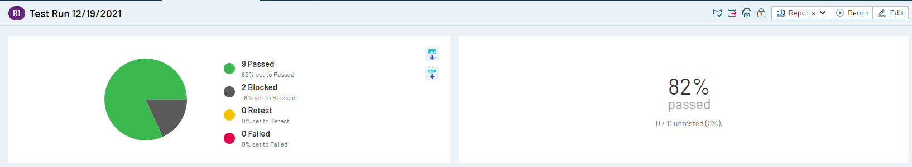
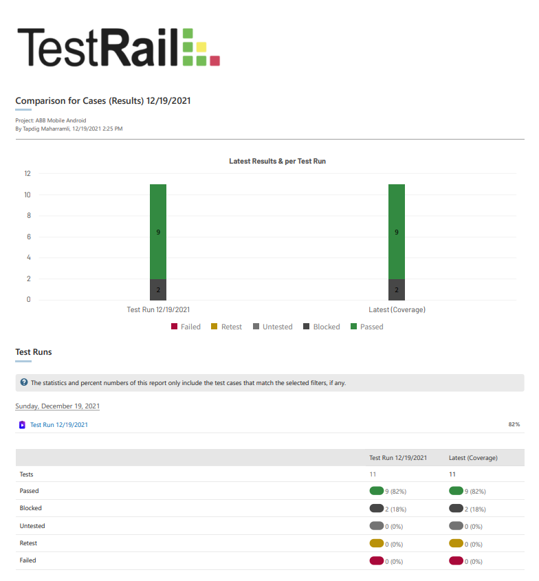

# User Acceptance Test Report

This report includes the findings from the User Acceptance Test performed on ABB Mobile Android application as a QA-LAB18.

### Application Details
* Name: ABB Mobile
* Version: 3.14.5

#### Following functions were tested:
* Registration
* OTP process
* Login
* Password change
* PIN (access code of application) change
* PIN reset
* Payment to mobile operator

##### Results
In total 11 tests were performed of which 9 were passed and 2 were blocked due to missing functionalities. Password change and PIN change functions were not available, the only way to change PIN was to reset it in the page where PIN code is required to enter the application.

Summary report has been added to the repository along with test cases with steps and other details in the csv file. (Can be opened with Excel)

